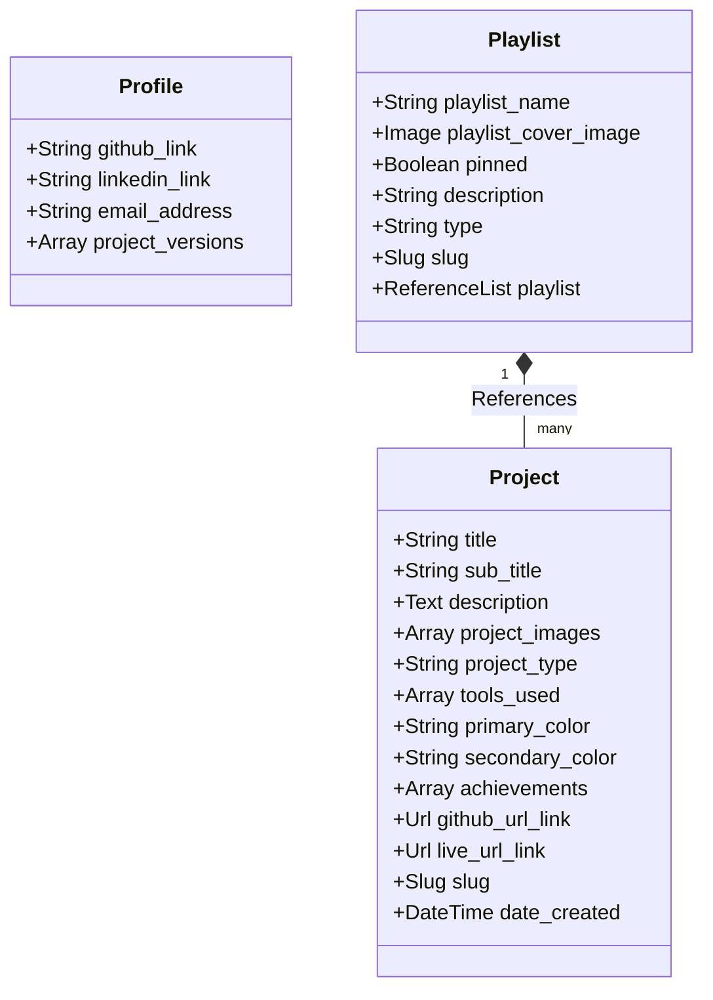

# Portfolio Website 2025

In order for you to deploy this website,

1. You must first create the different KV namespaces in your Cloudflare dashboard. You can either use the dashboard or the Wrangler CLI to do this. You can run `npm run kv create-kv -- KV_NAMESPACE_NAME`.
2. You must create the following kv namespaces, this is taken from the `wrangler.jsonc` file:
   - PLAYLIST_KV_CACHE
   - PROFILE_KV_CACHE
   - PROJECT_KV_CACHE
3. Once you have created the KV namespaces, you will get the ID of the KV namespace. Update the `wrangler.jsonc` file with the ID of the KV namespace.

## App Structure & UI Routes

The project is built using Next.js App Router. The UI routes are organized using route groups to separate layouts and concerns:

### UI Routes Summary

- **`/login`** ([login/page.tsx](./src/app/\(login\)/login/page.tsx)):
  - The login page for administrative/studio access.
- **`/portfolio`** ([portfolio/page.tsx](./src/app/\(home\)/portfolio/page.tsx)):
  - The main portfolio dashboard, displaying categorized project categories, active selections, and playlists.
- **`/portfolio/[project_type]/[slug]`** ([slug/page.tsx](./src/app/\(home\)/portfolio/\[project_type\]/\[slug\]/page.tsx)):
  - Dedicated detail view for a specific project based on its type and slug.
- **`/portfolio/playlist/[playlist_slug]`** ([playlist_slug/page.tsx](./src/app/\(home\)/portfolio/playlist/\[playlist_slug\]/page.tsx)):
  - View displaying a custom curated playlist of projects or contents.
- **`[[...catch]]`** ([catch/page.tsx](./src/app/\(catch\)/\[\[...catch\]\]/page.tsx)):
  - Wildcard catch-all route to handle fallback routing and 404 behavior.

### Core Folder Structure

- **`src/app/`**: Route definitions, pages, layouts, and global styles.
- **`src/components/`**: Reusable React UI elements (sidebar, layout components, buttons, custom icons).
- **`src/models/`**: Server-side data fetching and cache management models (e.g., projects, playlists, user profile).
- **`src/sanity/`**: Sanity.io client setup, schemas, and queries.
- **`src/redux/`**: Redux Toolkit slices, providers, and state management (to be migrated to Context).
- **`studio/`**: Sanity Studio configuration files for CMS management.

---

## Data Schema & Relations (Sanity.io)

The application uses three core Sanity document schemas defined in `studio/schemaTypes/`:

### Schema Details

1. **`projects` (Document)**
   - Represents all portfolio items including standard **Projects**, **Blogs**, **Work Experience**, and **Education**.
   - Differentiated by the `project_type` field.
   - Includes metadata (colors, live demo URLs, github links, tech stack details).

2. **`playlists` (Document)**
   - Acts as a container/grouping mechanism (similar to a Spotify playlist).
   - Contains a list of references (`playlist`) linking to multiple `projects` documents.
   - Includes metadata (cover image, name, description, pinned state).

3. **`profile` (Document)**
   - Represents global user/developer profile settings.
   - Stores contact details, social links, and lists of alternative/previous project versions.
