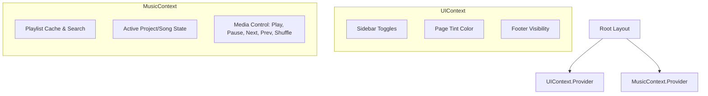

# Plan: Replace Redux with Vanilla React Context

This plan outlines the steps to migrate state management from Redux Toolkit to Vanilla React Context. This will simplify the codebase, reduce boilerplate, and align better with Next.js App Router (by avoiding global store hydration/singletons).

---

## 1. Inventory of Redux Slices

We currently have 5 slices in `src/redux/slice`:

1. **`layoutSlice.ts`**: Toggle sidebar, toggle mobile sidebar, footer visibility.
2. **`styleSlice.ts`**: Custom page tint color.
3. **`playlistSlice.ts`**: Storing fetched playlists and search query filtering.
4. **`projectDataSlice.ts`**: Active project/media player state (playing, projects list, active project, next/prev navigation, shuffling).
5. **`projectPageSlice.ts`**: Display modal states, layout modes (grid/page, fullPage).

---

## 2. Target Architecture (React Contexts)

Instead of a single global store, we will partition the state into three focused React Contexts located under a new `src/context/` directory:

### Context Definitions

#### A. `UIContext` (replaces `layoutSlice` & `styleSlice`)

* **State**:
  * `isSidebarOpen` (boolean)
  * `isMobileSidebarOpen` (boolean)
  * `isFooterVisible` (boolean)
  * `tintColor` (string)
* **Actions**:
  * `toggleSidebar()`, `setSidebar(isOpen: boolean)`
  * `toggleMobileSidebar()`, `setMobileSidebar(isOpen: boolean)`
  * `setFooterVisible(isVisible: boolean)`
  * `setTintColor(color: string)`

#### B. `MusicContext` (replaces `playlistSlice` & `projectDataSlice` & `projectPageSlice`)

* **State**:
  * `playlists` (PlaylistsSummary)
  * `searchQuery` (string)
  * `projects` (CategorisedProjects | null)
  * `currentProject` (CategorisedProject | null)
  * `isPlaying` (boolean)
  * `isShuffling` (boolean)
  * `layoutGridMode` (boolean)
  * `showProjectDetailsModal` (boolean)
* **Actions**:
  * `setPlaylists(playlists)`
  * `setSearchQuery(query)`
  * `setPlaying(isPlaying)`
  * `setShuffling(isShuffling)`
  * `selectCategory(category)`
  * `playProject(project)`
  * `nextProject()`, `prevProject()`
  * `setLayoutGridMode(isGrid)`
  * `setShowProjectDetailsModal(show)`

---

## 3. Step-by-Step Migration Strategy

### Phase 1: Create Context Providers

1. Create `src/context/UIContext.tsx`.
2. Create `src/context/MusicContext.tsx`.
3. Export custom hooks `useUI()` and `useMusic()` for easy context consumption.

### Phase 2: Root Setup

1. In `src/components/layout/resizableLayout.tsx` (and root layout if applicable), wrap children with the new context providers.
2. Remove `<SidebarProvider>` (the Redux-based one).

### Phase 3: Component Refactoring (File-by-File)

Refactor components using Redux hooks (`useSelector`, `useDispatch`) to use `useUI()` or `useMusic()` instead.

* **Sidebar & Layout**:
  * `sidebar.tsx`, `sidebarHeader.tsx`, `sidebarSearch.tsx` -> Use `useUI()` for toggles; `useMusic()` for playlist list search.
* **Equalizer/Player Controls**:
  * `projectNavigationButton.tsx`, `playButton.tsx`, player controls -> Use `useMusic()` for play/pause/skip.
* **Modals & Tinting**:
  * Color hook references, modal wrappers -> Use `useUI()` for tint color.

### Phase 4: Clean Up Redux

1. Delete `src/redux` directory completely.
2. Uninstall `@reduxjs/toolkit` and `react-redux` from `package.json`.
3. Verify that the app builds (`npm run build`) and starts (`npm run dev`) successfully.
